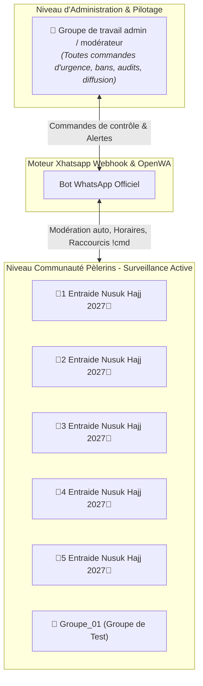
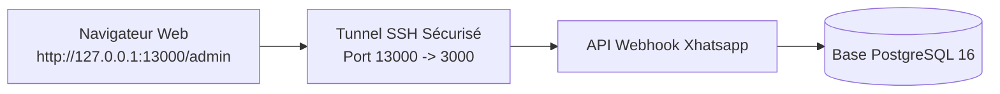

# Dossier d’Exploitation (DEX) & Guide des Commandes Administrateurs
## Plateforme Xhatsapp 0.6.0 — Entraide Nusuk Hajj 1447 / 2026

Ce document constitue le **manuel de référence opérationnel et technique** destiné à l'équipe d'administration, aux modérateurs de la communauté WhatsApp et aux exploitants du serveur VPS.

---

## 1. Vue d’Ensemble & Typologie des Groupes

Le système Xhatsapp supervise la communauté WhatsApp à travers **3 types de groupes distincts**, chacun ayant des règles et des commandes spécifiques :



| Type de Groupe | Rôle & Permissions | Comportement du Bot |
|:---|:---|:---|
| **Groupe Admin**<br/>`Groupe de travail admin/ modérateur` | Réservé aux administrateurs et modérateurs officiels. | Reçoit toutes les alertes (modération, citations d'agences, sentinelle panique, alertes doublons). Traite les commandes de pilotage globales (`BLOCK ALL`, `BAN`, `FLASH`, etc.). |
| **Groupes Surveillés**<br/>`🕋1` à `🕋5` + `Groupe_01` (test) | Groupes publics ouverts aux futurs pèlerins. | Suppression 100% automatique des citations d'agences, contrôle anti-doublon aux adhésions, verrouillage/déverrouillage automatique selon les horaires, exécution des raccourcis de liens (`!youtube`, etc.). |
| **Groupes Non-Surveillés / Externes** | Groupes personnels ou tiers où le bot est présent. | Totalement ignorés par le bot (aucune modération, aucun message envoyé). |

---

## 2. Guide Rapide des Commandes WhatsApp

### 📌 Synthèse de Référence Rapide

| Commande | Où la taper | Qui peut l'exécuter | Rôle & Effet |
|:---|:---|:---|:---|
| **`BLOCK ALL`** | Groupe Admin | Admins | Verrouille immédiatement tous les groupes surveillés aux seuls admins. |
| **`UNBLOCK ALL`** | Groupe Admin | Admins | Déverrouille et réouvre les discussions dans tous les groupes surveillés. |
| **`FLASH <message>`** | Groupe Admin | Admins | Verrouille tous les groupes et diffuse une alerte officielle prioritaire. |
| **`STATUT`** / **`SANTE`** | Groupe Admin | Admins | Affiche l'état de santé du bot, de la session WhatsApp et des groupes. |
| **`DOUBLONS`** | Groupe Admin | Admins | Lance un audit en temps réel des pèlerins présents dans plusieurs groupes. |
| **`MODERATEURS`** | Groupe Admin | Admins | Liste les numéros exemptés du contrôle anti-doublons. |
| **`BAN <numéro> [motif]`** | Groupe Admin | Admins | Expulse le membre de tous les groupes et l'ajoute à la liste noire permanente. |
| **`UNBAN <numéro>`** | Groupe Admin | Admins | Retire le numéro de la liste noire. |
| **`LISTE BAN`** / **`BLACKLIST`** | Groupe Admin | Admins | Affiche la liste des membres bannis et leurs motifs. |
| **`SUPPRIMER <CODE>`** | Groupe Admin | Admins | Valide la suppression d'un message signalé par la modération (don/pub). |
| **`IGNORER <CODE>`** | Groupe Admin | Admins | Conserve un message signalé et classe l'alerte sans action. |
| **`COMMUNICATION\n<texte>`** | Groupe Admin | Admins | Crée un brouillon de diffusion multi-groupes avec code de confirmation. |
| **`PUBLIER <CODE>`** | Groupe Admin | Admins | Valide et expédie la diffusion officielle dans tous les groupes. |
| **`ANNULER <CODE>`** | Groupe Admin | Admins | Annule un brouillon de communication en attente. |
| **`GO RECAP <CODE>`** | Groupe Admin | Admins | Valide et publie le récapitulatif quotidien de 20h10 généré par l'IA. |
| **`ANNULER RECAP <CODE>`** | Groupe Admin | Admins | Rejette le récapitulatif proposé. |
| **`RESSOURCES`** / **`LIENS`** | Groupe Admin | Admins | Affiche l'ensemble des fiches et raccourcis officiels. |
| **`SET LIEN <id> <url>`** | Groupe Admin | Admins | Met à jour directement l'URL d'un lien (ex: `SET LIEN youtube https://...`). |
| **`!youtube`, `!serie`, `!soeurs`...** | Groupes Surveillés | **Admins & Mods** | Partage instantanément la fiche officielle avec son lien (latence 0ms). |
| **`!liens`** / **`!ressources`** | Groupes Surveillés | **Admins & Mods** | Partage le catalogue complet de tous les liens officiels. |

---

## 3. Détail des Commandes par Espace

### 3.1. Commandes du Groupe Admin (`Groupe de travail admin/ modérateur`)

#### 🔴 Urgence & Sécurité Opérationnelle
- **`BLOCK ALL`** (ou `VERROUILLER TOUT`, `BLOK ALL`)
  - **Action :** Passe instantanément **tous les groupes surveillés** (`🕋1` à `🕋5` et `Groupe_01`) en mode *"Seuls les administrateurs peuvent envoyer des messages"*.
  - **Message automatique diffusé dans les groupes :**
    > 🔒 *GROUPE TEMPORAIREMENT VERROUILLÉ*  
    > Les discussions sont temporairement suspendues par l’équipe d’administration. Seuls les administrateurs peuvent publier le temps de diffuser une information ou de modérer les échanges.
  - **Confirmation dans le groupe admin :** Affiche le nombre exact de groupes verrouillés avec succès (ex: `6/6 groupes surveillés verrouillés`).

- **`UNBLOCK ALL`** (ou `DEVERROUILLER TOUT`, `DEVERROUILLER TOUS`)
  - **Action :** Rouvre immédiatement la parole à tous les participants dans tous les groupes surveillés.
  - **Message automatique diffusé dans les groupes :**
    > 🔓 *DISCUSSIONS RÉOUVERTES*  
    > Les discussions sont de nouveau ouvertes à tous. Merci à chacune et chacun de veiller au respect de la bienveillance, de la fraternité et de la neutralité.

- **`FLASH <Votre message>`**
  - **Action :** Procédure d'urgence en 2 étapes automatiques :
    1. Verrouille immédiatement tous les groupes surveillés pour stopper les messages en cours.
    2. Diffuse le message d'alerte encadré par le bandeau officiel Nusuk :
       > 🚨 *FLASH INFO OFFICIEL NUSUK* 🚨  
       > ───────────────────────────  
       > [Votre message ici]  
       > ───────────────────────────  
       > ℹ️ _Message officiel de l’équipe d’administration._
  - **Remarque importante :** Les groupes **restent verrouillés** après le flash pour laisser le temps aux membres de lire l'information. Tapez `UNBLOCK ALL` dès que vous souhaitez réautoriser les discussions.

---

#### 🛡️ Modération, Bannissements & Gestion des Doublons
- **`BAN <numéro> [motif]`** (ou `BLACKLIST <numéro>`, `EXPULSER <numéro>`)
  - **Exemples :**
    - `BAN 0612345678 Publicité abusive d'agence`
    - `BAN +33612345678 Arnaque faux visa`
  - **Action :**
    1. Vérifie que le numéro n'est pas un administrateur ou un modérateur exempté (protection anti-erreur).
    2. Expulse immédiatement le numéro de tous les groupes surveillés où il est présent.
    3. Rejette automatiquement ses demandes d'adhésion en attente.
    4. Inscrit le numéro dans la **liste noire permanente** en base de données.
    5. Si ce numéro tente de rejoindre un groupe par lien d'invitation à l'avenir, sa demande est instantanément rejetée avec alerte dans le groupe admin.

- **`UNBAN <numéro>`** (ou `DEBAN <numéro>`, `DEBLOQUER <numéro>`)
  - **Exemple :** `UNBAN +33612345678`
  - **Action :** Supprime le numéro de la liste noire. La personne pourra à nouveau rejoindre les groupes.

- **`LISTE BAN`** (ou `BANS`, `BLACKLIST`, `LISTE NOIRE`)
  - **Action :** Affiche l'inventaire complet des numéros actuellement bannis, avec la date, le motif et l'administrateur ayant ordonné le ban.

- **`DOUBLONS`** (ou `AUDIT DOUBLONS`, `DOUBLON`)
  - **Action :** Interroge en direct l'API WhatsApp pour cartographier les participants de l'ensemble des groupes surveillés.
  - **Filtrage intelligent :** Les administrateurs WhatsApp et les modérateurs enregistrés dans la liste blanche sont automatiquement exclus de l'audit.
  - **Résultat affiché :**
    - Nombre de groupes scannés et total de pèlerins distincts répertoriés.
    - Liste nominative des personnes présentes dans 2 groupes ou plus avec leurs numéros et les noms des groupes concernés.

- **`MODERATEURS`** (ou `LISTE MODERATEURS`, `WHITELIST`)
  - **Action :** Affiche la liste des comptes officiels (bénévoles, admins, modérateurs, comptes de secours) autorisés à être présents dans tous les groupes sans jamais être signalés comme doublons.

- **`STATUT`** (ou `SANTE`, `STATUS`, `ETAT`, `INFOS`)
  - **Action :** Génère un bilan de santé exhaustif en temps réel :
    - État de la session WhatsApp (🟢 Connecté avec le numéro du bot).
    - Mode de protection Anti-Ban (🟢 ACTIF).
    - Liste des groupes surveillés avec le nombre de membres et leur état de verrouillage (`🔒 Verrouillé` ou `🔓 Ouvert`).
    - Horaires des automatisations (Europe/Paris).
    - Nombre de modérateurs exemptés et nombre de personnes en liste noire.

---

#### ⚖️ Traitement des Alertes de Modération Manuelle
Lorsqu'un message suspect (appel aux dons, cagnotte, offre commerciale ou publicité) est détecté dans un groupe surveillé sans certitude absolue, le bot ne le supprime pas seul mais génère une alerte dans le groupe admin :
```text
🚨 Alerte de modération Xhatsapp
🏷️ Référence : K7X9P2
📋 Motif : don, cagnotte ou appel aux dons
👥 Groupe : 🕋1 Entraide Nusuk Hajj 2027🕋
👤 Auteur : Jean Dupont (+336...)
💬 Contenu du message signalé :
"..."
⚠️ Décision humaine requise :
👉 Pour supprimer : SUPPRIMER K7X9P2
👉 Pour conserver : IGNORER K7X9P2
```
- **`SUPPRIMER <CODE>`** : Supprime immédiatement le message dans le groupe pèlerin pour tout le monde.
- **`IGNORER <CODE>`** : Classe l'alerte et conserve le message dans le groupe.

---

#### 📢 Diffusion Multi-Groupes (Broadcast Officiel)
Pour adresser une communication identique et officielle à tous les pèlerins en simultané :

1. **Rédiger le brouillon :** Envoyez dans le groupe admin un message commençant obligatoirement par le mot `COMMUNICATION` sur la première ligne :
   ```text
   COMMUNICATION
   Chers futurs pèlerins,
   Le ministère du Hajj vient de publier une mise à jour importante...
   ```
2. **Contrôle préalable du bot :** Le bot génère un aperçu avec un code de confirmation unique à 6 caractères (ex: `B7D4E2`) et la liste figée des groupes destinataires.
3. **Validation de l'envoi :**
   - Tapez **`PUBLIER B7D4E2`** pour lancer la diffusion échelonnée avec protection anti-spam.
   - Tapez **`ANNULER B7D4E2`** pour abandonner l'envoi.
   - Si une erreur réseau survient sur certains groupes : tapez **`REESSAYER B7D4E2`** pour ne renvoyer que sur les groupes en échec.

---

#### 📋 Récapitulatif Quotidien de 20h10 (Généré par l'IA)
Chaque soir à **20h10**, le bot analyse les discussions de la journée de tous les groupes surveillés, filtre le bruit et produit une synthèse structurée et bienveillante.
- Le bot publie la proposition de synthèse **dans le groupe admin uniquement** avec un code de validation :
  - **`GO RECAP <CODE>`** : Valide le résumé et le diffuse immédiatement dans tous les groupes de pèlerins.
  - **`ANNULER RECAP <CODE>`** : Annule la diffusion du récapitulatif pour ce soir.
  - **`REESSAYER RECAP <CODE>`** : Relance la génération en cas d'erreur de modèle.

---

#### 🔗 Administration des Liens & Ressources depuis WhatsApp
- **`RESSOURCES`** (ou `LIENS`, `LISTE LIENS`) : Affiche la liste des fiches enregistrées avec leurs identifiants et URLs.
- **`SET LIEN <id> <url>`** : Modifie instantanément l'URL cible d'une ressource.
  - *Exemple :* `SET LIEN youtube https://www.youtube.com/@nouvellechaine`
  - *Exemple :* `SET LIEN soeurs https://t.me/+NouveauLienTelegram`

---

### 3.2. Raccourcis Disponibles dans les Groupes de Pèlerins (`🕋1` à `🕋5`, `Groupe_01`)

> [!IMPORTANT]
> **Protection Anti-Spam & Droits :**
> Ces commandes sont **strictement réservées aux administrateurs et modérateurs** des groupes. Si un pèlerin ordinaire tape `!youtube`, le bot l'ignore silencieusement afin d'éviter les boucles de spam.
> **Latence 0 ms :** Grâce au cache des numéros administrateurs, la réponse du bot est instantanée.

| Raccourci | Nom de la Ressource | Contenu Partagé par le Bot |
|:---|:---|:---|
| **`!youtube`** | Chaîne YouTube Officielle | Lien vers la chaîne officielle d'entraide Nusuk Hajj. |
| **`!Série`** ou **`!serie`** | Série Complète Nusuk | Playlist vidéo pas-à-pas pour préparer son départ. |
| **`!podcast`** | Podcasts Nusuk Hajj | Playlist des épisodes audio/vidéo et retours d'expérience. |
| **`!tuto`** | Tutoriels Vidéos Pratiques | Playlist des tutoriels d'inscription et de navigation. |
| **`!live`** | Rediffusions des Lives | Playlist des sessions de questions/réponses en direct. |
| **`!soeurs`** | Groupe Telegram Soeurs | Lien d'invitation au canal et groupe d'entraide dédié aux sœurs. |
| **`!site`** | Site Web Officiel | Lien du portail internet de la communauté. |
| **`!faq`** | Foire Aux Questions | Questions fréquentes sur les démarches et le pèlerinage. |
| **`!hotels`** | Localisation des Hôtels | Cartes interactives des hôtels à La Mecque et Médine. |
| **`!packages`** | Guide des Offres | Analyse et comparatif des formules et forfaits. |
| **`!retouche`** | Retouche Photo Passeport | Outil de mise en conformité des photos pour Nusuk. |
| **`!liens`** ou **`!ressources`** | Catalogue Complet | Carte générale regroupant l'ensemble de tous les liens ci-dessus. |

> [!TIP]
> **Détection en Langage Naturel :**
> Si un modérateur écrit une phrase comme *"Vous pouvez regarder notre tutoriel sur la chaîne youtube"*, le bot identifie le mot-clé et propose poliment la fiche correspondante (avec un délai de courtoisie de 60 secondes pour ne pas surcharger la discussion).

---

## 4. Guide de la Console Web `/admin`

L'interface Web `/admin` permet aux coordinateurs de configurer l'ensemble du système sans taper une seule ligne de code.



### 4.1. Procédure d'Accès Sécurisé
1. Sur votre PC administrateur (PowerShell), lancez le script utilitaire :
   ```powershell
   cd "C:\Users\yahia.abdelkhalki\Downloads\Gestion Whatsapp"
   .\tunnel-xhatsapp.ps1
   ```
2. Choisissez l'option **[1] Ouvrir le tunnel vers l'interface Web /admin**.
3. Choisissez l'option **[5] Copier le jeton XHATSAPP_ADMIN_TOKEN dans le presse-papiers**.
4. Ouvrez Chrome sur **`http://127.0.0.1:13000/admin`**, collez votre jeton et validez.

---

### 4.2. Fonctionnalités des Onglets de l'Interface

#### 👥 1. Gestion des Groupes & Synchronisation
- **Bouton `Actualiser l'inventaire` :** Réinterroge l'appareil WhatsApp connecté pour détecter les nouveaux groupes créés ou les renommages.
- **Grille des groupes :** Pour chaque groupe, cochez les droits accordés au bot :
  - `Actif` : Le bot traite le groupe.
  - `Surveillance` : Modération active, contrôle doublons, horaires.
  - `Admin` : Désigne le groupe de pilotage de l'équipe (reçoit les alertes).
  - `Test` : Isole le groupe pour les essais.

#### 🏢 2. Dictionnaires de Modération
- **Agences interdites :**
  - Ajout/Suppression de noms d'agences de voyage.
  - *Comportement :* Si une de ces agences est citée dans un groupe surveillé, le message est **supprimé à la seconde même** pour tous les membres, un message de rappel de neutralité est posté dans le groupe, et une notification détaillée est envoyée dans le groupe admin.
- **Dons & Cagnottes :** Liste des mots-clés déclenchant une alerte manuelle (`cotizup`, `leetchi`, `paypal`, `rib`, etc.).
- **Pubs & Placements :** Liste des mots-clés publicitaires (`promo`, `remise`, `influenceur`, etc.).
- **🛡️ Modérateurs & Exemptés :** Liste blanche des téléphones (coordonnateurs, admins) exemptés d'anti-doublon.
- **🚫 Liste Noire (Bannis) :** Liste des téléphones définitivement bannis, avec motif et bouton `Débannir`.
- **🔗 Liens & Ressources :** Gestion visuelle des commandes `!cmd` :
  - Création de nouvelles commandes (ex: `!guide`, `!visa`).
  - Édition des titres, descriptions, liens et mots-clés associés.
  - Suppression de raccourcis obsolètes.

#### 💬 3. Personnalisation des Messages Automatiques
Permet de modifier les textes envoyés par le bot sans toucher aux fichiers source :
- **Message d’ouverture matinale :** Diffusé à l'heure configurée lors de la réouverture des échanges.
- **Message de fermeture nocturne :** Diffusé avant le verrouillage nocturne pour inciter au repos.
- **Rappel de neutralité agence :** Message accompagnant la suppression automatique des citations d'agences.
- **Message de bienvenue (Onboarding DM) :** Message privé explicatif des règles envoyé aux nouveaux entrants.
- **Message de refus de doublon (DM privé) :** Message explicatif avec variables automatiques `{newGroupName}` et `{existingGroupName}`.

#### 🕒 4. Horaires d'Ouverture et Fermeture Automatiques
- Configuration des heures (ex: `09:00` ouverture / `19:00` fermeture).
- Sélection des jours d'application (du lundi au dimanche).
- Bouton **`Vérifier droits`** : Teste instantanément si le bot détient bien les permissions d'administration WhatsApp requises pour verrouiller/déverrouiller le groupe sans altérer son état.

---

## 5. Exploitation Serveur & Fiches Réflexes Techniques

### 5.1. Commandes Utiles sur le VPS (SSH)

Pour vous connecter au VPS Linux :
```powershell
ssh -i "C:\Users\yahia.abdelkhalki\Admin_key.pem" azureuser@20.19.180.187
```

| Opération | Commande Bash sur le VPS |
|:---|:---|
| **Vérifier l'état des conteneurs** | `sudo docker ps --format "table {{.Names}}\t{{.Status}}\t{{.Ports}}"` |
| **Suivre les logs du Webhook en direct** | `sudo docker logs -f --tail 100 xhatsapp-webhook` |
| **Suivre les logs WhatsApp (OpenWA)** | `sudo docker logs -f --tail 50 xhatsapp-openwa` |
| **Vérifier l'état de la session WhatsApp** | `sudo docker exec xhatsapp-openwa curl -s http://127.0.0.1:2785/api/health/ready` |
| **Redémarrer le Webhook après mise à jour** | `cd /opt/xhatsapp && sudo docker compose build webhook && sudo docker compose up -d webhook` |
| **Sauvegarde manuelle immédiate** | `sudo systemctl start xhatsapp-backup.service` |

---

### 5.2. Résolution des Pannes Fréquentes

#### 🚨 Cas 1 : Le bot ne répond plus aux commandes et ne supprime plus rien
- **Diagnostic :** La session WhatsApp s'est probablement déconnectée (smartphone éteint, mise à jour WhatsApp mobile).
- **Résolution :**
  1. Lancez `./tunnel-xhatsapp.ps1` option **[2]** pour ouvrir le port `:2785`.
  2. Ouvrez Chrome sur `http://127.0.0.1:2785`.
  3. Si la session est en `disconnected` ou `qr`, cliquez sur **Scan QR** et scannez le code avec le téléphone officiel du bot.
  4. Dès que l'état repasse au vert (`ready`), le bot reprend automatiquement toutes ses fonctions.

#### 🚨 Cas 2 : Un membre banni réussit quand même à poster
- **Diagnostic :** Le numéro a peut-être changé ou a été entré avec un mauvais préfixe international.
- **Résolution :**
  - Dans le groupe admin, tapez : `BAN +336... Motif`
  - Le bot expulsé immédiatement le participant et verrouille l'accès.

#### 🚨 Cas 3 : Les raccourcis `!youtube` sont lents à répondre
- **Diagnostic :** Le cache des administrateurs a pu expirer ou une requête Puppeteer distante ralentit.
- **Résolution :**
  - La version actuelle intègre le pré-chargement en mémoire (`KNOWN_LID_PHONE_MAP`). Un simple redémarrage du conteneur webhook (`sudo docker restart xhatsapp-webhook`) réinitialise le cache en 1 seconde.

---

## 6. Historique des Versions & Traçabilité

- **v0.1.0 à v0.5.0 :** Socle de base, reverse proxy HTTPS Caddy, modération par regex, intégration IA OmniRoute.
- **v0.6.0 :** 
  - Centralisation des messages d'ouverture/fermeture et dictionnaires dynamiques sur `/admin`.
  - Ajout des commandes d'urgence `BLOCK ALL`, `UNBLOCK ALL`, `FLASH`.
  - Système d'audit des doublons en temps réel et liste des modérateurs exemptés.
  - Commandes de bannissement multi-groupes avec expulsion synchrone.
  - Gestion dynamique des ressources et raccourcis (`!youtube`, `!serie`, `!podcast`, `!tuto`, `!live`, `!soeurs`, `!retouche`...).
  - Optimisation 0 ms de la latence de détection des administrateurs (gestion native des identifiants LID WhatsApp).
