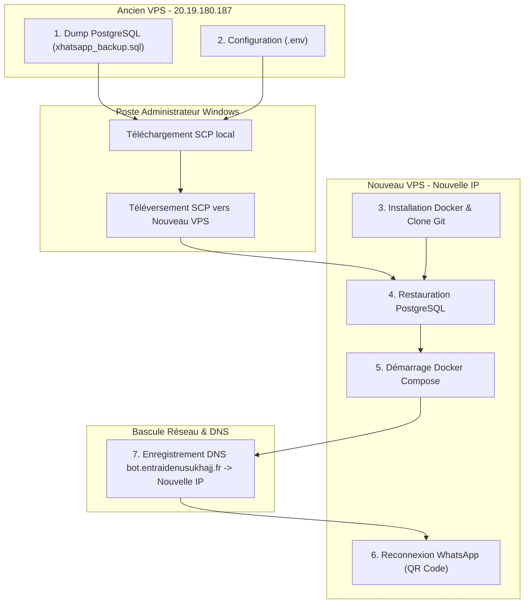

# Guide de Migration VPS — Plateforme Xhatsapp 0.6.0
## Communauté Entraide Nusuk Hajj 1447 / 2026

Ce document décrit la procédure complète pour migrer l'ensemble de l'infrastructure **Xhatsapp** d'un serveur VPS existant vers un nouveau serveur VPS, **proprement et sans aucune perte de données** (historiques, 7 groupes configurés, 82+ agences interdites, messages automatiques personnalisés, raccourcis de liens, liste blanche des modérateurs et liste noire des membres bannis).

---

## 1. Vue d’Ensemble & Schéma de Migration



---

## 2. Caractéristiques Recommandées du Nouveau VPS

| Composant | Spécification Recommandée | Minimum Requis |
|:---|:---|:---|
| **Système d'exploitation** | Ubuntu 24.04 LTS (ou 22.04 LTS) 64-bit | Ubuntu 22.04 LTS |
| **Processeur (CPU)** | 4 vCPU | 2 vCPU |
| **Mémoire Vive (RAM)** | 8 à 16 Go | 4 Go (+ 4 Go swap) |
| **Disque (Stockage)** | 80 à 120 Go SSD / NVMe | 40 Go SSD |
| **Pare-feu (Ports publics entrants)** | **22** (SSH), **80** (HTTP Caddy Let's Encrypt), **443** (HTTPS) | Strictement ces 3 ports |

> [!CAUTION]
> **Sécurité des ports :** Les ports internes `3000` (Webhook), `2785` (OpenWA), `20128` (OmniRoute), `5432` (Postgres) et `6379` (Redis) doivent impérativement **rester fermés au public**. L'accès administrateur se fait exclusivement via tunnel SSH.

---

## 3. Procédure Pas-à-Pas de Migration

### Étape 1 : Sauvegarder les Données depuis l'Ancien VPS

Connectez-vous en SSH sur l'**ancien serveur VPS** :
```bash
ssh -i "C:\Users\yahia.abdelkhalki\Admin_key.pem" azureuser@20.19.180.187
```

Exécutez l'export de la base de données PostgreSQL et du fichier `.env` :
```bash
# 1. Générer le dump complet de la base de données
sudo docker exec xhatsapp-postgres pg_dump -U xhatsapp xhatsapp > /tmp/xhatsapp_backup.sql

# 2. Copier le fichier d'environnement et ajuster les droits de lecture
sudo cp /opt/xhatsapp/.env /tmp/xhatsapp.env
sudo chmod 644 /tmp/xhatsapp.env /tmp/xhatsapp_backup.sql
```

Depuis votre **PC Windows (PowerShell)**, rapatriez les fichiers en local :
```powershell
# Placez-vous dans votre dossier de travail
cd "C:\Users\yahia.abdelkhalki\Downloads\Gestion Whatsapp"

# Téléchargement via SCP
scp -i "C:\Users\yahia.abdelkhalki\Admin_key.pem" azureuser@20.19.180.187:/tmp/xhatsapp_backup.sql .\
scp -i "C:\Users\yahia.abdelkhalki\Admin_key.pem" azureuser@20.19.180.187:/tmp/xhatsapp.env .\
```

---

### Étape 2 : Préparer le Nouveau Serveur VPS

Connectez-vous sur le **nouveau VPS** :
```bash
ssh -i "C:\Users\yahia.abdelkhalki\Admin_key.pem" azureuser@NOUVELLE_IP_VPS
```

#### 2.1. Installer Docker et les utilitaires système
```bash
# Mise à jour des paquets
sudo apt update && sudo apt upgrade -y

# Installation officielle de Docker
curl -fsSL https://get.docker.com | sudo sh

# Ajouter votre utilisateur au groupe docker
sudo usermod -aG docker $USER

# Configurer l'horloge système (synchronisation NTP critique pour WhatsApp)
sudo apt install -y chrony
sudo timedatectl set-timezone Europe/Paris
```
*(Déconnectez-vous puis reconnectez-vous en SSH pour activer les droits Docker de votre utilisateur).*

#### 2.2. Cloner le dépôt Git du projet
```bash
sudo mkdir -p /opt/xhatsapp
sudo chown $USER:$USER /opt/xhatsapp
git clone https://github.com/yahiaman/xhatsapp.git /opt/xhatsapp
```

---

### Étape 3 : Transférer les Fichiers & Restaurer la Base de Données

Depuis votre **PC Windows (PowerShell)**, envoyez la sauvegarde vers le nouveau serveur :
```powershell
scp -i "C:\Users\yahia.abdelkhalki\Admin_key.pem" .\xhatsapp.env azureuser@NOUVELLE_IP_VPS:/opt/xhatsapp/.env
scp -i "C:\Users\yahia.abdelkhalki\Admin_key.pem" .\xhatsapp_backup.sql azureuser@NOUVELLE_IP_VPS:/tmp/
```

Sur le **nouveau VPS**, sécurisez le fichier `.env` et démarrez la restauration :
```bash
cd /opt/xhatsapp

# Sécuriser les permissions du .env
chmod 600 .env

# 1. Démarrer uniquement le conteneur PostgreSQL
sudo docker compose --env-file .env up -d postgres

# 2. Laisser 5 secondes à PostgreSQL pour initialiser son socket
sleep 5

# 3. Injecter la sauvegarde dans la base de données
sudo docker exec -i xhatsapp-postgres psql -U xhatsapp -d xhatsapp < /tmp/xhatsapp_backup.sql

# 4. Nettoyer le fichier temporaire de dump
rm -f /tmp/xhatsapp_backup.sql
```

> [!TIP]
> **Ce qui est restauré instantanément :** Vos 7 groupes configurés avec leurs permissions, vos 82 agences interdites, vos messages d'ouverture/fermeture personnalisés, vos 12 raccourcis `!cmd`, vos modérateurs exemptés et la liste noire des personnes bannies.

---

### Étape 4 : Démarrer l'Ensemble des Services

Toujours sur le **nouveau VPS** :
```bash
cd /opt/xhatsapp

# Lancer la compilation et le démarrage de toute la stack
sudo docker compose --env-file .env up -d --build

# Vérifier que les conteneurs sont tous UP et en bonne santé
sudo docker compose --env-file .env ps
```
*Les conteneurs `xhatsapp-caddy`, `xhatsapp-webhook`, `xhatsapp-openwa`, `xhatsapp-postgres`, `xhatsapp-redis` et `xhatsapp-omniroute` doivent être affichés avec le statut `Up`.*

---

### Étape 5 : Basculer le Nom de Domaine (DNS)

Connectez-vous à l'espace d'administration de votre nom de domaine (OVH, Cloudflare, Gandi, etc.) :
1. Accédez à la zone DNS de `entraidenusukhajj.fr`.
2. Éditez l'enregistrement de type **`A`** du sous-domaine **`bot.entraidenusukhajj.fr`**.
3. Remplacez l'ancienne adresse IP (`20.19.180.187`) par la **nouvelle IP publique** de votre nouveau VPS.
4. Réglez le TTL à 300 secondes (5 minutes) si possible pour une propagation rapide.

> Dès la prise en compte du DNS, le frontal Caddy du nouveau VPS négociera automatiquement un nouveau certificat SSL HTTPS gratuit auprès de Let's Encrypt.

---

### Étape 6 : Arrêter l'Ancien Bot & Reconnecter WhatsApp

> [!WARNING]
> **Règle essentielle :** Ne laissez jamais tourner simultanément deux instances OpenWA connectées au même numéro WhatsApp, sous peine de provoquer des déconnexions intempestives ou des alertes de sécurité Meta.

#### 1. Éteindre les conteneurs sur l'ancien VPS :
```bash
# Sur l'ancien VPS (20.19.180.187) :
cd /opt/xhatsapp
sudo docker compose --env-file .env down
```

#### 2. Associer la session WhatsApp sur le nouveau VPS :
Depuis votre **PC Windows (PowerShell)**, ouvrez le tunnel SSH vers l'interface OpenWA du nouveau VPS :
```powershell
ssh -N -i "C:\Users\yahia.abdelkhalki\Admin_key.pem" -L 2785:127.0.0.1:2785 azureuser@NOUVELLE_IP_VPS
```

* Ouvrez votre navigateur **Google Chrome** sur : **`http://127.0.0.1:2785`**.
* Connectez-vous avec la clé maîtresse `OPENWA_API_MASTER_KEY` présente dans votre `.env`.
* Cliquez sur **Scan QR**.
* Sur le smartphone officiel du bot : Ouvrez **WhatsApp** $\rightarrow$ **Appareils connectés** $\rightarrow$ **Connecter un appareil**, et scannez le QR code affiché.
* Dès que le statut de la session passe à **`ready`** (vert), le bot est reconnecté et opérationnel.

---

### Étape 7 : Contrôle de Fonctionnement & Validation Finale

1. **Test WhatsApp depuis le Groupe Admin :**
   * Dans le `Groupe de travail admin/ modérateur`, tapez :
     ```text
     STATUT
     ```
   * Le bot doit vous répondre avec le bilan complet (Session connectée, 6 groupes surveillés, état de verrouillage, horaires d'automatisation).

2. **Test d'un raccourci dans un groupe de pèlerins :**
   * Tapez `!youtube` ou `!serie` : la fiche doit apparaître immédiatement (latence 0 ms).

3. **Vérification de la console Web `/admin` :**
   * Ouvrez le tunnel SSH :
     ```powershell
     ssh -N -i "C:\Users\yahia.abdelkhalki\Admin_key.pem" -L 13000:127.0.0.1:3000 azureuser@NOUVELLE_IP_VPS
     ```
   * Accédez à **`http://127.0.0.1:13000/admin`** avec votre jeton `XHATSAPP_ADMIN_TOKEN`.
   * Vérifiez que tous les onglets (Groupes, Dictionnaires, Liens, Messages automatiques) sont bien peuplés.

---

## 4. Fiche Réflexe en Cas de Rollback (Retour Arrière)

Si vous devez interrompre la migration ou revenir temporairement sur l'ancien VPS :
1. Sur le nouveau VPS : `sudo docker compose --env-file /opt/xhatsapp/.env down`
2. Chez votre registraire DNS : remettez l'adresse IP de l'ancien VPS (`20.19.180.187`).
3. Sur l'ancien VPS : `cd /opt/xhatsapp && sudo docker compose --env-file .env up -d`
4. L'ancien serveur reprend immédiatement son rôle nominal.
